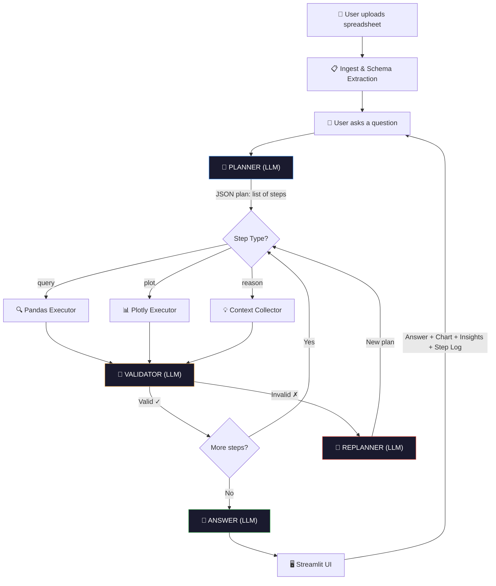

# Planner Assistant

A lightweight conversational data assistant that follows a structured **Plan → Act → Reflect → Answer** loop.

Upload any spreadsheet, ask questions in plain English, and get answers with charts and insights — not guesses.

🚀 **[Live Demo](https://planner-assistant.streamlit.app/)**

---

## Overview

Most data chatbots rely on a single LLM response. That works for simple queries, but breaks quickly on anything involving multiple steps or reasoning.

Planner Assistant takes a different approach:

* Breaks questions into executable steps
* Runs them sequentially using Pandas/Plotly
* Validates intermediate outputs
* Recovers automatically from errors

The result is a system that behaves more like a data analyst than a chatbot.

---

## Usage

1. Upload a `.csv` or `.xlsx` file via the sidebar
2. Ask questions in plain English
3. Continue with follow-up questions — context is preserved

**Example questions:**

* `How many unique products are in this data?`
* `What is the average value grouped by category?`
* `Plot throughput by day`
* `Why is there a gap between these two entries?`
* `Show only the top 10 from that`

---

## Architecture & Data Flow



---

## Agent Loop

```
1. PLAN
   LLM reads schema + question
   Outputs structured steps

2. ACT
   Executes each step:
   - query → pandas
   - plot  → plotly
   - reason → context aggregation

3. REFLECT
   Validates intermediate results
   Fixes errors and replans if needed

4. ANSWER
   Generates final response with insights
```

---

## Why this approach works

| Single Prompt                | Plan-Act-Reflect      |
| ---------------------------- | --------------------- |
| Breaks on multi-step queries | Decomposes into steps |
| Silent failures              | Validates each step   |
| No recovery                  | Auto-replanning       |
| No transparency              | Step logs available   |

---

## How it works (end-to-end)

### 1. File Upload (`app.py` lines 117–127)

```python
if uploaded and uploaded.name != st.session_state.filename:
    df = pd.read_csv(uploaded)
    st.session_state.df = df
```
The dataset is stored in `st.session_state` to persist across Streamlit reruns.

---

### 2. Schema Extraction (`tools.py` lines 50–116)

```python
schema = {
    "columns": {col: str(dtype) for col, dtype in df.dtypes.items()},
    # ... adds sample rows, numeric stats, categorical info
}
```
Instead of passing full data, the system sends a compact schema:

* Column names and types
* 5 sample rows
* Numeric statistics (min, max, mean, nulls)
* Categorical previews (up to 8 values)

This keeps the system efficient and avoids token overflow.

---

### 3. Planning (`agent.py` lines 223–283)

```python
prompt = PLANNER_PROMPT.format(schema=schema, question=question, history=history_str)
```
The LLM generates a JSON plan:

* `query` → data manipulation
* `plot` → visualization
* `reason` → logical interpretation

---

### 4. Execution + Auto-Healing (`agent.py` lines 285–391)

```python
exec(code, exec_namespace)
```
Steps run in a persistent namespace.

If a step fails:

* Error is captured
* Sent back to the LLM
* Code is rewritten and retried

This retry logic is implemented in the agent loop.

---

### 5. Answer Generation (`agent.py` lines 393–411)

```python
answer = llm.call(ANSWER_PROMPT.format(question=question, context=context_str))
```
All intermediate results are collected (with size limits), and the final answer is generated based only on computed outputs — not assumptions.

---

## Project Structure

```
app.py           — Streamlit UI
agent.py         — Plan → Act → Reflect → Answer loop
tools.py         — Execution layer (pandas + plotly)
llm.py           — LLM wrapper (Groq)
requirements.txt — Dependencies
.env             — API key
README.md        — Documentation
```

---

## Tech Stack

| Component | Choice               | Reason                                |
| --------- | -------------------- | ------------------------------------- |
| LLM       | Groq + Llama 3.3 70B | Fast inference, open weights          |
| UI        | Streamlit            | Simple and effective for data apps    |
| Data      | Pandas               | Standard for tabular operations       |
| Charts    | Plotly               | Interactive visualizations            |
| Agent     | Custom loop          | Full control, no abstraction overhead |

---

## Swapping the LLM

All model calls are isolated in `llm.py` 

```python
from openai import OpenAI

client = OpenAI(base_url="http://localhost:11434/v1", api_key="ollama")
MODEL = "llama3"
```

No other part of the system needs to change.

---

## Performance Notes

Current latency:

* Planner → ~1–2s
* Validator → ~0.5s per step
* Answer → ~1–2s

Optimizations:

* Cache schema prompt
* Skip validation for simple queries
* Stream final response

---

## Design Decisions

* Built without frameworks (no LangChain/CrewAI) for clarity and control
* Uses `exec()` for flexibility (sandboxing required in production)
* Validation loop prevents incorrect outputs from reaching the user
* Maintains short conversational memory for efficient follow-ups

---

## Key Parameters

| Parameter            | Purpose                                         |
| -------------------- | ----------------------------------------------- |
| 6 history turns      | Supports follow-up queries without prompt bloat |
| 3 planning attempts  | Handles malformed LLM outputs                   |
| 2 retries per step   | Fixes most execution errors                     |
| 3 planner history turns | Planner only needs intent context, keeps plan fast |
| 80 char truncation   | LLM only needs the gist of prior conversational turns |
| 5 sample rows        | Captures data shape efficiently                 |
| 50 row cap           | Prevents context overflow                       |
| 8 categorical values | Shows patterns without noise                    |
| 4 JSON strategies    | Each fixes a specific, observed LLM failure mode|
| Temperature = 0      | Ensures deterministic code generation           |
| Persistent namespace | Allows later steps to reuse earlier variables   |
| 6 suggested questions| Fills two columns cleanly, highlights breadth   |

---

## Limitations

* Execution is not sandboxed yet
* Large datasets rely on summarized schema
* Multi-table joins are not supported

---
