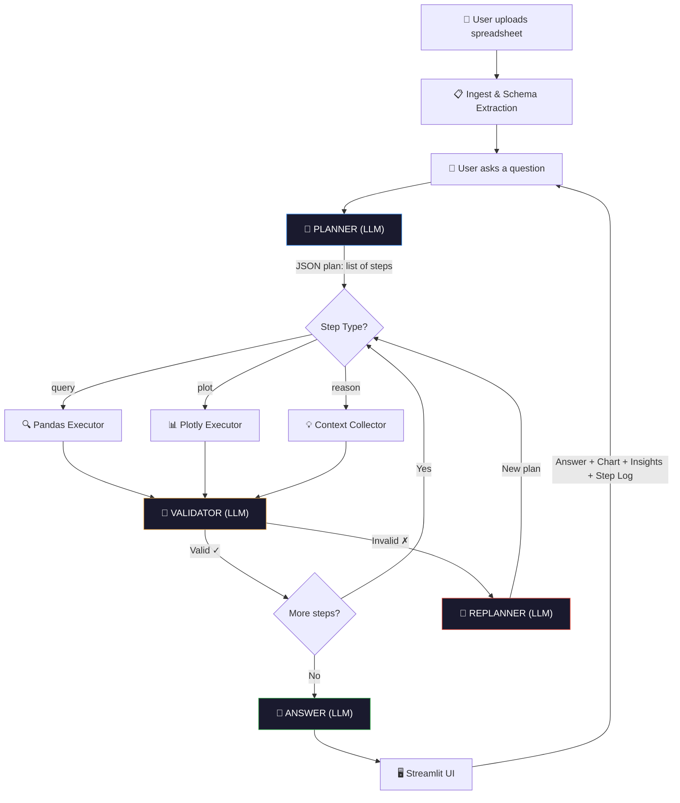

# Planner Assistant

A lightweight conversational data assistant with a **Plan → Act → Reflect → Answer** agent loop.  
Upload any spreadsheet, ask questions in plain English, get answers with auto-generated charts and insights.

🚀 **[Live Demo](https://planner-assistant.streamlit.app/)**

---


## Usage

1. Upload any `.csv` or `.xlsx` file via the sidebar
2. Ask questions in plain English
3. Follow-up questions retain context from previous turns

**Example questions to try:**
- `How many unique products are in this data?`
- `What is the average value grouped by category?`
- `Plot throughput by day`
- `Why is there a gap between these two entries?` ← tests reasoning
- `Show only the top 10 from that` ← tests follow-up

---

## Architecture & Data Flow



### Agent Loop Detail

```
┌─────────────────────────────────────────────────────┐
│                    Agent Loop                        │
│                                                      │
│  1. PLAN    → LLM reads schema + question            │
│              → Outputs JSON: [{type, goal, code}]    │
│                                                      │
│  2. ACT     → Execute each step:                     │
│              → query: pandas exec → result           │
│              → plot:  plotly exec → fig               │
│              → reason: collect context                │
│                                                      │
│  3. REFLECT → LLM validates intermediate results     │
│              → If invalid → replan & retry            │
│                                                      │
│  4. ANSWER  → LLM synthesizes final response         │
│              → Adds Insight if noteworthy             │
└─────────────────────────────────────────────────────┘
```

### Why This Matters (vs Single-Prompt)

| Single Prompt | Plan-Act-Reflect |
|---|---|
| Fails on multi-hop questions | Breaks into steps, validates each |
| Can't recover from wrong assumptions | Replans on bad intermediate results |
| No auditability | Step log shown in UI |
| LLM must hold all reasoning in one call | Each step is focused and verifiable |

---

## How It Actually Works: End-to-End Flow

**1. File Upload & Setup (`app.py`)**  
Uploading a CSV stores the DataFrame in `st.session_state` so it survives Streamlit's constant reruns without reloading from disk.

**2. Schema Extraction (`tools.py`)**  
`get_schema()` converts the dataset into a compact ~2KB JSON string containing: column names and types, 5 sample rows, numeric stats (min, max, mean, nulls), and unique values for categorical columns (up to 8). This summary is all the LLM ever sees—it never reads the full dataset directly.

**3. Planning Phase (`agent.py`)**  
When the user asks a question, the LLM processes it against the schema and up to 3 turns of conversational history to generate a JSON plan of sequential steps:
- **query**: pandas code for calculations/filtering
- **plot**: plotly code for charting
- **reason**: pure reasoning based on previous outputs

**4. Execution & Auto-Healing (`agent.py`)**  
The steps execute sequentially in a persistent, shared Python environment (`exec_namespace`). If the generated code fails (e.g., a `KeyError`), the LLM automatically receives the exact error and schema to write a fix, retrying up to 2 times.

**5. Synthesis (`agent.py`)**  
The executed step results are gathered in a context dictionary (restricted to 10-row previews to save tokens). A final LLM pass uses these computed results to narrate a natural language answer with analytical insights.

---

## File Structure

```
app.py           — Streamlit UI (upload, chat loop, render)
agent.py         — ReAct loop (plan, act, reflect, answer)
tools.py         — Pandas query executor + plotly chart executor
llm.py           — LLM wrapper (Groq + Llama 3.3, swappable)
requirements.txt — Python dependencies
.env             — API key (not committed)
README.md        — This file
```

---

## Tech Stack

| Component | Choice | Why |
|---|---|---|
| **LLM** | Groq + Llama 3.3 70B | State-of-the-art inference speed, open-weights, swappable |
| **UI** | Streamlit | Rapid prototyping, built-in data widgets |
| **Data** | Pandas | Industry standard, handles CSV/Excel |
| **Charts** | Plotly | Interactive, auto-renders in Streamlit |
| **Agent** | Custom ReAct loop | Full control, no framework lock-in |

---

## Swapping the LLM Backend

All LLM calls route through `llm.py`. To switch to a self-hosted model (Ollama, vLLM):

```python
# llm.py — change the client and model only
from openai import OpenAI

client = OpenAI(base_url="http://localhost:11434/v1", api_key="ollama")
MODEL = "llama3"
```

Everything else stays the same — agent logic, tools, and UI are fully decoupled.

---

## Latency Notes

Current bottlenecks (in order):
1. **Planner call** — ~1-2s. Cacheable if same schema is reused.
2. **Validator call** — ~0.5s per step. Can be skipped for simple questions.
3. **Answer call** — ~1-2s. Stream this to reduce perceived latency.

To reduce to <1s total: cache the schema prompt, skip validation on low-complexity questions, stream the final answer.

---

## Design Decisions

- **No framework**: Built the agent loop from scratch (no LangChain/CrewAI) — fewer dependencies, full control, easier to debug and extend.
- **Exec-based tools**: Using `exec()` for pandas/plotly gives the LLM full expressiveness. In production, this would be sandboxed.
- **Validation loop**: The reflect step catches LLM hallucinations early — e.g., querying a column that doesn't exist — and triggers a replan instead of returning garbage.
- **Conversation memory**: Last 6 turns are passed to both the planner and the answerer, enabling natural follow-ups like "show me just the top 5 from that".

---

## Magic Numbers & Parameters

Here's the one-line reason behind each number in case they ask on the spot:

| Decision | Why |
|---|---|
| 6 history turns | Covers 3 full exchanges — enough for follow-ups, not enough to bloat the prompt |
| 3 planning attempts | LLM JSON fails occasionally, but 3 tries = max 6 extra seconds before giving up |
| 2 step retries | Code fix prompt is targeted enough that one retry almost always works |
| 3 history turns in planner | Planner only needs intent context, not full conversation — keeps planning call lean |
| 80 char truncation | LLM needs the gist, not the full answer paragraph |
| 5 sample rows | Shows enough variation to understand data shape without bloating the schema |
| 50 row cap on results | LLM context limit — full 50k rows would overflow it |
| 8 categorical values | Enough to show the pattern (case, format, abbreviation style) without noise |
| 4 JSON parse strategies | Each one fixes a specific, observed LLM failure mode |
| Temperature 0 | Deterministic code gen — same question always produces the same pandas |
| Persistent namespace | Without it, step 2 can't use variables step 1 created |
| 6 suggested questions | Fills two columns cleanly, and the mix shows breadth not just aggregations |
