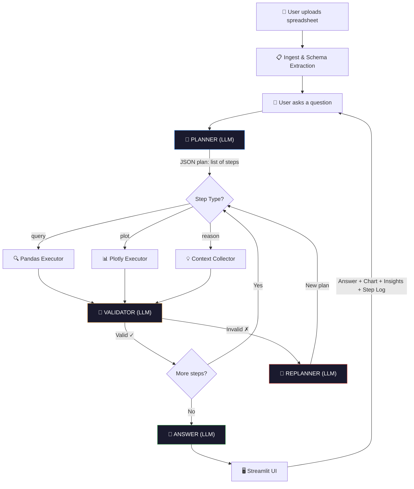

# Planner Assistant

A lightweight conversational data assistant with a **Plan → Act → Reflect → Answer** agent loop.  
Upload any spreadsheet, ask questions in plain English, get answers with auto-generated charts and insights.

---

## Setup

```bash
# 1. Clone / copy files
git clone <repo-url> && cd Demo

# 2. Install dependencies
pip install -r requirements.txt

# 3. Set API key (create .env file)
echo "GROQ_API_KEY=gsk_your_key_here" > .env

# 4. Run
streamlit run app.py
```

**Requirements:** Python 3.9+, Groq API key ([console.groq.com](https://console.groq.com))

---

## Usage

1. Upload any `.csv` or `.xlsx` file via the sidebar
2. Ask questions in plain English
3. Follow-up questions retain context from previous turns

**Example questions to try:**
- `How many unique products are in this data?`
- `What is the average value grouped by category?`
- `Plot throughput by day`
- `Why is there a gap between these two entries?` ← tests reasoning
- `Show only the top 10 from that` ← tests follow-up

---

## Architecture & Data Flow



### Agent Loop Detail

```
┌─────────────────────────────────────────────────────┐
│                    Agent Loop                        │
│                                                      │
│  1. PLAN    → LLM reads schema + question            │
│              → Outputs JSON: [{type, goal, code}]    │
│                                                      │
│  2. ACT     → Execute each step:                     │
│              → query: pandas exec → result           │
│              → plot:  plotly exec → fig               │
│              → reason: collect context                │
│                                                      │
│  3. REFLECT → LLM validates intermediate results     │
│              → If invalid → replan & retry            │
│                                                      │
│  4. ANSWER  → LLM synthesizes final response         │
│              → Adds Insight if noteworthy             │
└─────────────────────────────────────────────────────┘
```

### Why This Matters (vs Single-Prompt)

| Single Prompt | Plan-Act-Reflect |
|---|---|
| Fails on multi-hop questions | Breaks into steps, validates each |
| Can't recover from wrong assumptions | Replans on bad intermediate results |
| No auditability | Step log shown in UI |
| LLM must hold all reasoning in one call | Each step is focused and verifiable |

---

## File Structure

```
app.py           — Streamlit UI (upload, chat loop, render)
agent.py         — ReAct loop (plan, act, reflect, answer)
tools.py         — Pandas query executor + plotly chart executor
llm.py           — LLM wrapper (Groq + Llama 3.3, swappable)
requirements.txt — Python dependencies
.env             — API key (not committed)
README.md        — This file
```

---

## Tech Stack

| Component | Choice | Why |
|---|---|---|
| **LLM** | Groq + Llama 3.1 8B | Fast inference, open-source model, free tier |
| **UI** | Streamlit | Rapid prototyping, built-in data widgets |
| **Data** | Pandas | Industry standard, handles CSV/Excel |
| **Charts** | Plotly | Interactive, auto-renders in Streamlit |
| **Agent** | Custom ReAct loop | Full control, no framework lock-in |

---

## Swapping the LLM Backend

All LLM calls route through `llm.py`. To switch to a self-hosted model (Ollama, vLLM):

```python
# llm.py — change the client and model only
from openai import OpenAI

client = OpenAI(base_url="http://localhost:11434/v1", api_key="ollama")
MODEL = "llama3"
```

Everything else stays the same — agent logic, tools, and UI are fully decoupled.

---

## Latency Notes

Current bottlenecks (in order):
1. **Planner call** — ~1-2s. Cacheable if same schema is reused.
2. **Validator call** — ~0.5s per step. Can be skipped for simple questions.
3. **Answer call** — ~1-2s. Stream this to reduce perceived latency.

To reduce to <1s total: cache the schema prompt, skip validation on low-complexity questions, stream the final answer.

---

## Design Decisions

- **No framework**: Built the agent loop from scratch (no LangChain/CrewAI) — fewer dependencies, full control, easier to debug and extend.
- **Exec-based tools**: Using `exec()` for pandas/plotly gives the LLM full expressiveness. In production, this would be sandboxed.
- **Validation loop**: The reflect step catches LLM hallucinations early — e.g., querying a column that doesn't exist — and triggers a replan instead of returning garbage.
- **Conversation memory**: Last 6 turns are passed to both the planner and the answerer, enabling natural follow-ups like "show me just the top 5 from that".